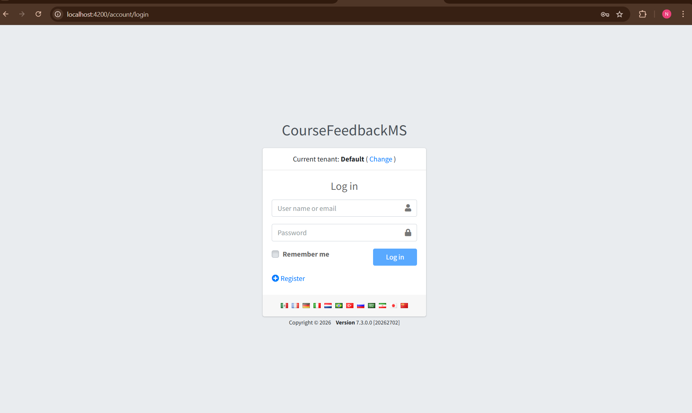
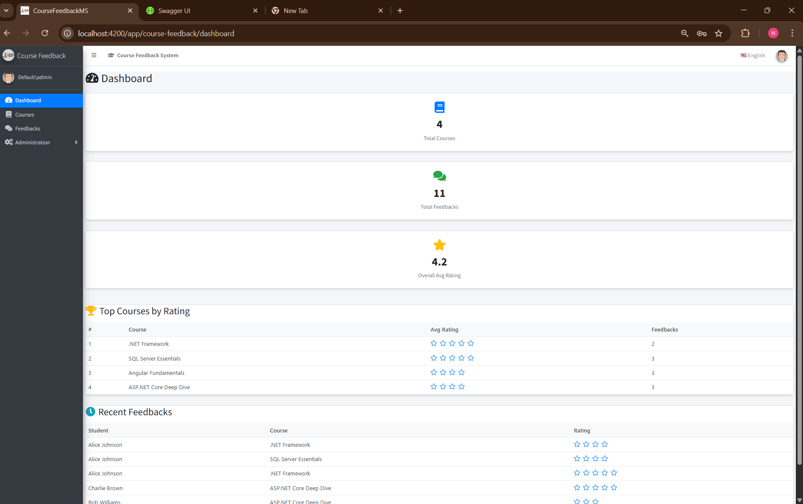
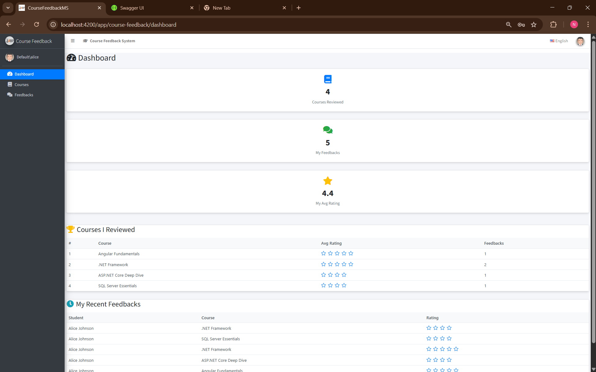
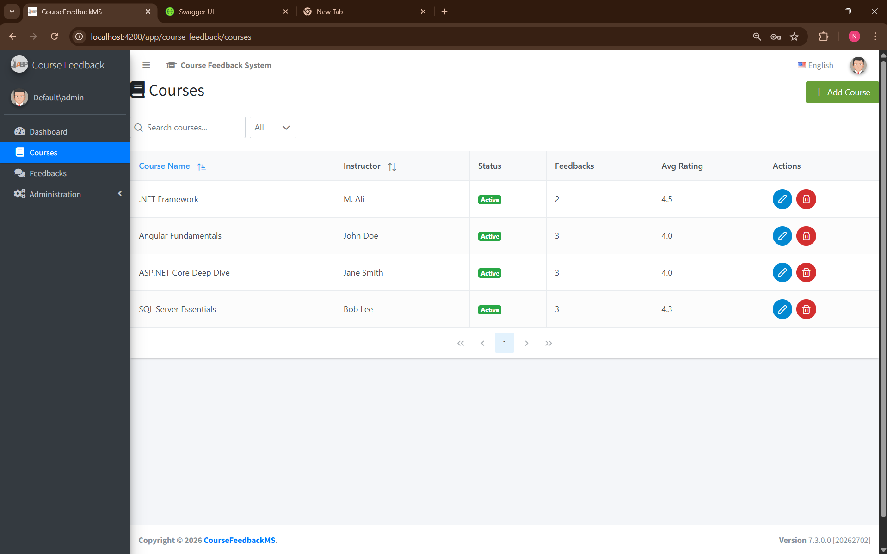
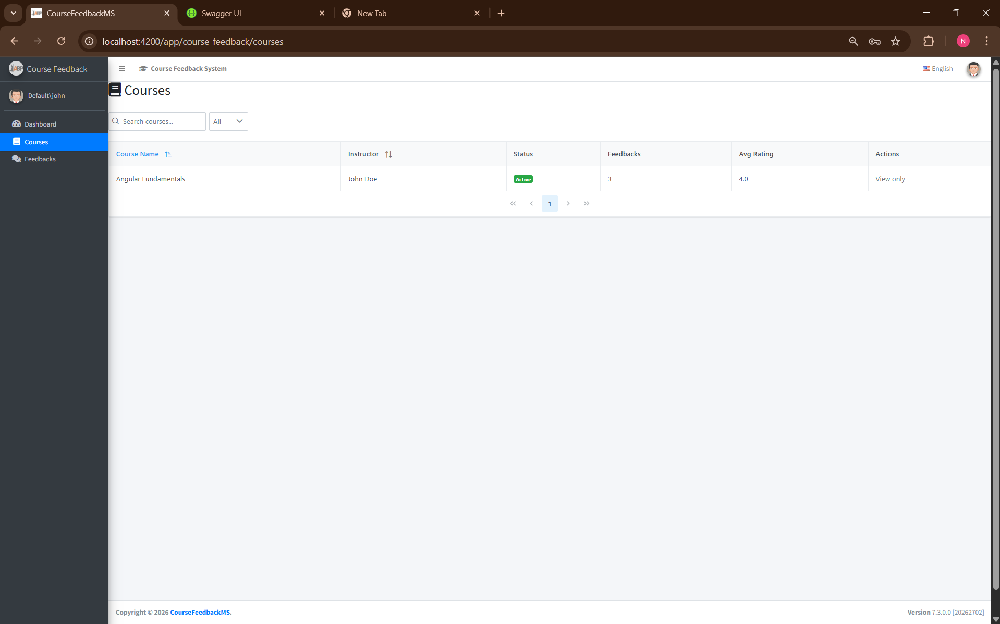
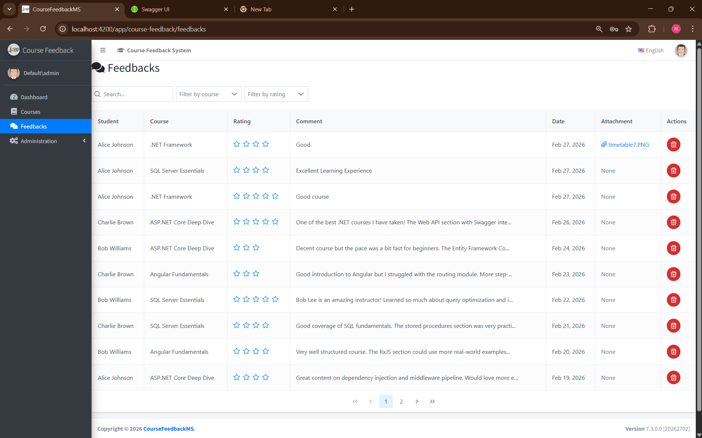
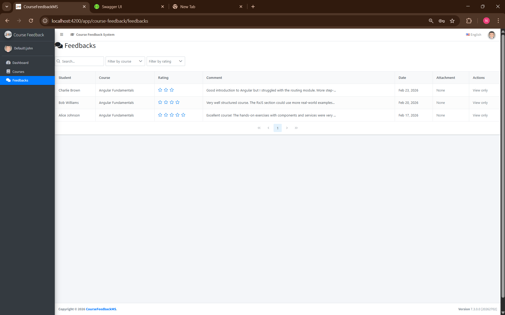
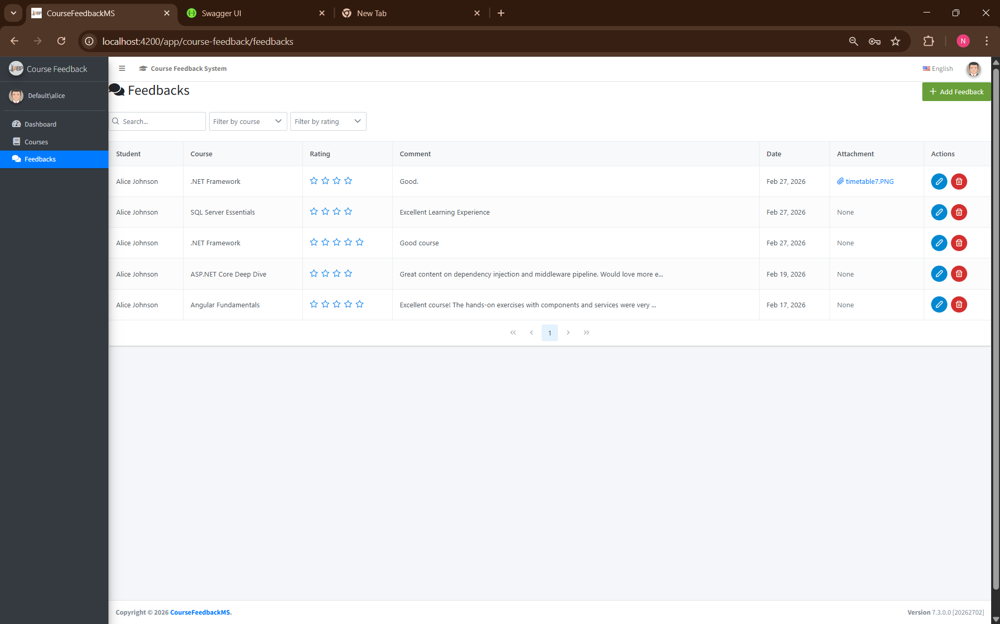

# Course Feedback Management System

A role-based web application for managing course feedback in an academic setting. Built with **ASP.NET Core 6 (ABP Framework 7.3)** on the backend and **Angular 12** with **PrimeNG** on the frontend.

---

## Features

- **Role-Based Access Control** — Admin, Teacher, and Student roles with granular permissions
- **Course Management** — Full CRUD for courses (Admin only)
- **Feedback Submission** — Students submit feedback with ratings (1–5), comments, and file attachments
- **Dashboard** — Role-adaptive dashboard showing personalized stats:
  - *Admin* — system-wide totals, top courses, all recent feedbacks
  - *Teacher* — only their courses, feedbacks received from students
  - *Student* — only courses they reviewed, their own feedbacks
- **File Attachments** — PDF, JPG, PNG uploads (max 10 MB) stored on server
- **Hangfire Background Jobs** — Scheduled job checks courses with low feedback activity
- **Tenant Settings** — Configurable max-feedback-per-course limit

---

## Tech Stack

| Layer | Technology |
|---|---|
| Backend | ASP.NET Core 6.0, ABP Framework 7.3.0 |
| Frontend | Angular 12, PrimeNG 12, PrimeFlex 3 |
| Database | SQL Server (LocalDB or full instance) |
| Background Jobs | Hangfire 1.8 |
| Auth | ABP Identity with JWT tokens |
| UI Theme | AdminLTE 3 + PrimeNG components |

---

## Prerequisites

Before you begin, make sure the following are installed:

- [.NET 6.0 SDK](https://dotnet.microsoft.com/download/dotnet/6.0)
- [Node.js 16+](https://nodejs.org) (tested with Node.js 22 using `--openssl-legacy-provider`)
- [SQL Server](https://www.microsoft.com/en-us/sql-server/sql-server-downloads) (LocalDB, Express, or full edition)
- [Git](https://git-scm.com/)

---

## Setup Instructions

### 1. Clone the Repository

```bash
git clone <repository-url>
cd CourseFeedbackMS/7.3.0
```

### 2. Backend Setup

```bash
cd aspnet-core
```

**a) Update the connection string** in `src/CourseFeedbackMS.Web.Host/appsettings.json`:

```json
"ConnectionStrings": {
  "Default": "Server=localhost; Database=CourseFeedbackMS; Trusted_Connection=True;"
}
```

**b) Apply database migrations:**

```bash
cd src/CourseFeedbackMS.EntityFrameworkCore
dotnet dotnet-ef database update --startup-project "../CourseFeedbackMS.Web.Host"
```

**c) Run the backend:**

```bash
cd ../CourseFeedbackMS.Web.Host
dotnet run
```

The API will start on **https://localhost:44311**.  
Swagger UI is available at `https://localhost:44311/swagger`.

### 3. Frontend Setup

Open a new terminal:

```bash
cd angular
npm install --legacy-peer-deps
```

> **Node.js 17+ users:** You must set the OpenSSL legacy provider before serving:
>
> - **Windows (PowerShell):** `$env:NODE_OPTIONS="--openssl-legacy-provider"`
> - **macOS / Linux:** `export NODE_OPTIONS=--openssl-legacy-provider`

```bash
npx ng serve --port 4200
```

The app will be available at **http://localhost:4200**.

### 4. Login

Navigate to `http://localhost:4200` and log in with:

- **Tenant:** `default`  (enter "default" in the tenant switch on the login page)

---

## Sample Credentials

| User | Username | Password | Role | Description |
|---|---|---|---|---|
| Administrator | `admin` | `123qwe` | Admin | Full system access, manages users/courses. Cannot submit feedback. |
| Teacher 1 | `john` | `123qwe` | Teacher | John Doe — instructs "Intro to Programming" and "Web Development" |
| Teacher 2 | `jane` | `123qwe` | Teacher | Jane Smith — instructs "Data Structures" and "Database Systems" |
| Student 1 | `alice` | `123qwe` | Student | Alice Johnson — can submit/edit/delete own feedback |
| Student 2 | `bob` | `123qwe` | Student | Bob Williams — can submit/edit/delete own feedback |
| Student 3 | `charlie` | `123qwe` | Student | Charlie Brown — can submit/edit/delete own feedback |

### Role Permissions Summary

| Action | Admin | Teacher | Student |
|---|---|---|---|
| View Dashboard | ✅ (all data) | ✅ (own courses) | ✅ (own feedbacks) |
| Create/Edit/Delete Courses | ✅ | ❌ | ❌ |
| View Courses | ✅ (all) | ✅ (own only) | ✅ (all) |
| Submit Feedback | ❌ | ❌ | ✅ |
| Edit/Delete Feedback | ❌ | ❌ | ✅ (own only) |
| View Feedbacks | ✅ (all) | ✅ (their courses) | ✅ (own only) |
| Manage Users & Roles | ✅ | ❌ | ❌ |

---

## Project Structure

```
7.3.0/
├── aspnet-core/                    # Backend solution
│   ├── src/
│   │   ├── CourseFeedbackMS.Core/              # Domain entities, permissions, roles
│   │   ├── CourseFeedbackMS.Application/       # App services, DTOs, AutoMapper, Hangfire jobs
│   │   ├── CourseFeedbackMS.EntityFrameworkCore/# DbContext, migrations, seed data
│   │   ├── CourseFeedbackMS.Web.Core/          # Auth, JWT config, base controllers
│   │   └── CourseFeedbackMS.Web.Host/          # Startup, API host, FileUploadController
│   └── test/                                   # Unit test projects
│
├── angular/                        # Frontend SPA
│   └── src/
│       ├── app/
│       │   ├── course-feedback/    # Main feature module
│       │   │   ├── dashboard/      # Role-adaptive dashboard
│       │   │   ├── courses/        # Course list & CRUD
│       │   │   ├── feedbacks/      # Feedback list, CRUD, file upload
│       │   │   └── services/       # API proxy services
│       │   ├── layout/             # Sidebar, navbar, header
│       │   └── ...                 # ABP built-in modules (users, roles, tenants)
│       └── shared/                 # Auth guards, pipes, base components
│
└── _screenshots/                   # UI screenshots
```

---

## Summary of AI Usage

This project was built with the assistance of **GitHub Copilot (Claude)** as an AI pair-programming partner. The AI was used for:

- **Code Generation** — Generating entity classes, DTOs, application services, Angular components, and HTML templates based on the build guide specifications
- **Architecture Guidance** — Implementing ABP Framework patterns (permission system, role-based authorization, tenant seed data, application services)
- **Role-Based Authorization Logic** — Designing and implementing the data-scoping strategy where each role (Admin/Teacher/Student) sees only the data relevant to them, enforced at the backend service layer
- **Bug Fixing** — Diagnosing and resolving compilation errors (e.g., missing `using` statements, incorrect API response wrappers), runtime issues (DLL file locks, terminal conflicts), and logic errors (rating dropdown, attachment path not saving)
- **UI/UX Refinement** — Cleaning up sidebar navigation, fixing PrimeNG component configurations, adapting the dashboard to show role-specific labels and data
- **Build & Deployment** — Assisting with `dotnet build`, `ng serve` commands, handling Node.js OpenSSL compatibility issues, and managing server processes

All AI-generated code was reviewed, tested, and refined through an iterative conversation-driven workflow.

---

## Screenshots

#### Login Page


#### Dashboard (Admin View)


#### Dashboard (Teacher View)


#### Dashboard (Student View)


#### Courses List


#### Courses (Teacher View)


#### Feedbacks List


#### Feedbacks (Teacher View)


#### Feedbacks (Student View)


> **Tip:** You can also record a short video walkthrough using a screen recorder and link it here:
> `[▶ Watch Video Walkthrough](link-to-video)`

---

## Seeded Sample Data

The database is seeded on first run with:

- **4 Courses:** .NET Framework, Angular Fundamentals, ASP.NET Core Deep Dive, SQL Server Essentials
- **5 Users:** 1 Admin, 2 Teachers, 3 Students (see credentials above)
- **8 Sample Feedbacks:** Distributed across courses and students with varied ratings

---

## License

[MIT](LICENSE)
